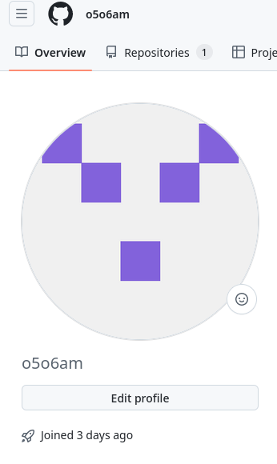
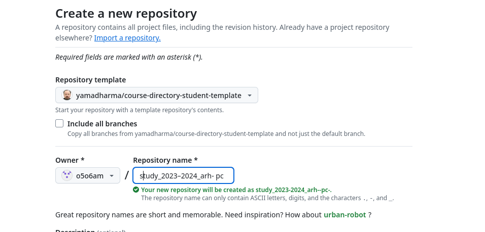

---
## Front matter
title: "Лабораторная работа №2"
subtitle: "Дисциплина: Архитектура компьютера"
author: "Симонова Полина Игоревна"

## Generic otions
lang: ru-RU
toc-title: "Содержание"

## Bibliography
bibliography: bib/cite.bib
csl: pandoc/csl/gost-r-7-0-5-2008-numeric.csl

## Pdf output format
toc: true # Table of contents
toc-depth: 2
lof: true # List of figures
fontsize: 12pt
linestretch: 1.5
papersize: a4
documentclass: scrreprt
## I18n polyglossia
polyglossia-lang:
  name: russian
  options:
	- spelling=modern
	- babelshorthands=true
polyglossia-otherlangs:
  name: english
## I18n babel
babel-lang: russian
babel-otherlangs: english
## Fonts
mainfont: IBM Plex Serif
romanfont: IBM Plex Serif
sansfont: IBM Plex Sans
monofont: IBM Plex Mono
mathfont: STIX Two Math
mainfontoptions: Ligatures=Common,Ligatures=TeX,Scale=0.94
romanfontoptions: Ligatures=Common,Ligatures=TeX,Scale=0.94
sansfontoptions: Ligatures=Common,Ligatures=TeX,Scale=MatchLowercase,Scale=0.94
monofontoptions: Scale=MatchLowercase,Scale=0.94,FakeStretch=0.9
mathfontoptions:
## Biblatex
biblatex: true
biblio-style: "gost-numeric"
biblatexoptions:
  - parentracker=true
  - backend=biber
  - hyperref=auto
  - language=auto
  - autolang=other*
  - citestyle=gost-numeric
## Pandoc-crossref LaTeX customization
figureTitle: "Рис."
tableTitle: "Таблица"
listingTitle: "Листинг"
lofTitle: "Список иллюстраций"
lolTitle: "Листинги"
## Misc options
indent: true
header-includes:
  - \usepackage{indentfirst}
  - \usepackage{float} # keep figures where there are in the text
  - \floatplacement{figure}{H} # keep figures where there are in the text
---

# Цель работы

Целью работы является изучить идеологию и применение средств контроля версий. Приобрести практические навыки по работе с системой git.

# Задание

1. Настройка github 
2. Базовая настройка git
3. Создание SSH ключа
4. Создание рабочего пространства и репозитория курса на основе шаблона
5. Создание репозитория курса на основе шаблона
6. Настройка каталога курса

# Выполнение лабораторной работы

## Техническое обеспечение

Лабораторная работа подразумевает выполнение настройки и работы с системой контроля версий Git (https://git-scm.com/). 
Лабораторная работа была выполнена на домашнем компьютере со следующими характеристиками:
- AMD Ryzen 3 2.60 GHz, 8 GB оперативной памяти, 219 GB свободного места на жёстком диске;
 - ОС Linux Fedora Workstation 40.
 
## Настройка github 

Существует несколько доступных серверов репозиториев с возможностью бесплатного размещения данных. Например, http://bitbucket.org/, https://github.com/ и https://gitflic.ru. Для выполнения лабораторных работ предлагается использовать Github. 
Создаю учётную запись на сайте https://github.com/ и заполняю основные данные. 
(рис. [-@fig:001])

{#fig:001 width=70% }

## Базовая настройка git

Сначала сделаем предварительную конфигурацию git. Откройте терминал и введите следующие команды, указав имя и email владельца репозитория:

git config --global user.name "<NameSurname>"

git config --global user.email "<workmail>"

Настроим utf-8 в выводе сообщений git:

git config --global core.quotepath false

Зададим имя начальной ветки (будем называть её master):

git config --global init.defaultBranch master

Параметр autocrlf:

git config --global core.autocrlf input

Параметр safecrlf:

git config --global core.safecrlf warn

Результат выполнения команд показан на рисунке (рис. [-@fig:002])

{#fig:002 width=70% }
 
{#fig:003 width=70% }
 
## Создание SSH ключа

Для последующей идентификации пользователя на сервере репозиториев необходимо сгенерировать пару ключей (приватный и открытый):
ssh-keygen -C "Имя Фамилия <workmail>" (рис. [-@fig:004])

{#fig:004 width=70% }

Ключи сохранятся в каталоге ~/.ssh/.
Далее необходимо загрузить сгенерённый открытый ключ. Для этого зайти на сайт http://github.org/ под своей учётной записью и перейти в меню Setting . После этого выбрать в боковом меню SSH and GPG keys и нажать кнопку New SSH key . Скопировав из локальной консоли ключ в буфер обмена 

cat ~/.ssh/id_rsa.pub | xclip -sel clip 

вставляем ключ в появившееся на сайте поле и указываем для ключа имя (Title). Результат выполнения показан на рисунке (рис. [-@fig:005])

{#fig:005 width=70% }

## Создание рабочего пространства и репозитория курса на основе шаблона

При выполнении лабораторных работ следует придерживаться структуры рабочего пространства. Рабочее пространство по предмету располагается в следующей иерархии:
~/work/study/
- < учебный год >/
- < название предмета >/
- < код предмета >/

Например, для 2023–2024 учебного года и предмета «Архитектура компьютера» (код предмета arch-pc) структура каталогов примет следующий вид:
~/work/study/
- 2023–2024/
- архитектура компьютера/
- arch-pc/
- labs/
- lab01/
- lab02/
- lab03/
...
- Каталог для лабораторных работ имеет вид labs.
- Каталоги для лабораторных работ имеют вид lab<номер>, например: lab01, lab02 ит.д. название проекта на хостинге git имеет вид: study_<учебный год>_<код предмета>
Например, для 2023–2024 учебного года и предмета «Архитектура компьютера» (код предмета arch-pc) название проекта примет следующий вид: study_2023–2024_arch-pc
Откройте терминал и создайте каталог для предмета «Архитектура компьютера»:
mkdir -p ~/work/study/2023-2024/"Архитектура компьютера" (рис. [-@fig:006])

{#fig:006 width=70% }

## Создание репозитория курса на основе шаблона

Репозиторий на основе шаблона можно создать через web-интерфейс github.
Перейдите на страницу репозитория с шаблоном курса https://github.com/yamadharma/course-directory-student-template. Далее выберите Use this template. (рис. [-@fig:007])

{#fig:007 width=70% }

В открывшемся окне задайте имя репозитория (Repository name) study_2023–2024_arhpc и создайте репозиторий (кнопка Create repository from template).
Откройте терминал и перейдите в каталог курса: cd ~/work/study/2023–2024/"Архитектура компьютера" клонируйте созданный репозиторий:
git clone --recursive git@github.com:<username>/study_2023–2024_arh-pc.git
arch-pc
Ссылку для клонирования можно скопировать на странице созданного репозитория Code -> SSH: (рис. [-@fig:008])

{#fig:008 width=70% }

## Настройка каталога курса

Перейдите в каталог курса: 
cd ~/work/study/2023-2024/"Архитектура компьютера"/arch-pc (рис. [-@fig:009])

{#fig:009 width=70% }

Удалите лишние файлы: 
rm package.json (рис. [-@fig:010])

{#fig:010 width=70% }

Создайте необходимые каталоги: (рис. [-@fig:011])
echo arch-pc > COURSE 
make

{#fig:011 width=70% }

Отправьте файлы на сервер: (рис. [-@fig:012])
git add . 
git commit -am 'feat(main): make course structure' 
git push

{#fig:012 width=70% }

Проверьте правильность создания иерархии рабочего пространства в локальном репозитории и на странице github. (рис. [-@fig:013])

{#fig:013 width=70% }

# Задание для самостоятельной работы 
 1. Создайте отчет по выполнению лабораторной работы в соответствующем каталоге рабочего пространства (labs>lab02>report). 
 2. Скопируйте отчеты по выполнению предыдущих лабораторных работ в соответствующие каталоги созданного рабочего пространства. 
 3. Загрузите файлы на github (рис. [-@fig:014])
 
{#fig:014 width=70% }
 
# Выводы

Я изучила идеологию и применение средств контроля версий и приобрела практические навыки по работе с системой git

# Список литературы{.unnumbered}

[Архитектура ЭВМ 2](https://esystem.rudn.ru/pluginfile.php/2089082/mod_resource/content/0/%D0%9B%D0%B0%D0%B1%D0%BE%D1%80%D0%B0%D1%82%D0%BE%D1%80%D0%BD%D0%B0%D1%8F%20%D1%80%D0%B0%D0%B1%D0%BE%D1%82%D0%B0%20%E2%84%962.%20%D0%A1%D0%B8%D1%81%D1%82%D0%B5%D0%BC%D0%B0%20%D0%BA%D0%BE%D0%BD%D1%82%D1%80%D0%BE%D0%BB%D1%8F%20%D0%B2%D0%B5%D1%80%D1%81%D0%B8%D0%B9%20Git.pdf)
