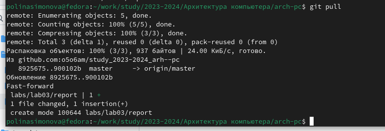
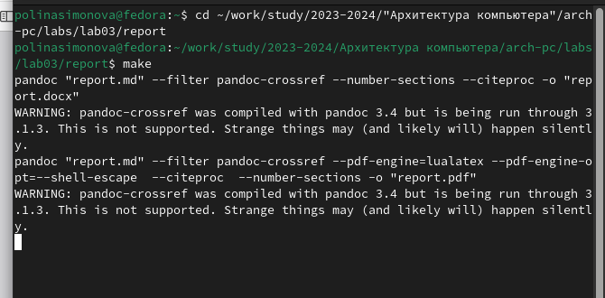
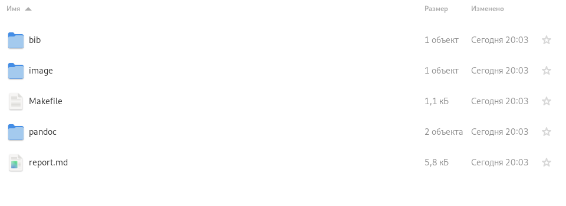

---
## Front matter
title: "Отчёт по лабораторной работе №3"
subtitle: "Дисциплина: Архитектура компьютеров"
author: "Симонова Полина  Игоревна"

## Generic otions
lang: ru-RU
toc-title: "Содержание"

## Bibliography
bibliography: bib/cite.bib
csl: pandoc/csl/gost-r-7-0-5-2008-numeric.csl

## Pdf output format
toc: true # Table of contents
toc-depth: 2
lof: true # List of figures
fontsize: 12pt
linestretch: 1.5
papersize: a4
documentclass: scrreprt
## I18n polyglossia
polyglossia-lang:
  name: russian
  options:
	- spelling=modern
	- babelshorthands=true
polyglossia-otherlangs:
  name: english
## I18n babel
babel-lang: russian
babel-otherlangs: english
## Fonts
mainfont: IBM Plex Serif
romanfont: IBM Plex Serif
sansfont: IBM Plex Sans
monofont: IBM Plex Mono
mathfont: STIX Two Math
mainfontoptions: Ligatures=Common,Ligatures=TeX,Scale=0.94
romanfontoptions: Ligatures=Common,Ligatures=TeX,Scale=0.94
sansfontoptions: Ligatures=Common,Ligatures=TeX,Scale=MatchLowercase,Scale=0.94
monofontoptions: Scale=MatchLowercase,Scale=0.94,FakeStretch=0.9
mathfontoptions:
## Biblatex
biblatex: true
biblio-style: "gost-numeric"
biblatexoptions:
  - parentracker=true
  - backend=biber
  - hyperref=auto
  - language=auto
  - autolang=other*
  - citestyle=gost-numeric
## Pandoc-crossref LaTeX customization
figureTitle: "Рис."
tableTitle: "Таблица"
listingTitle: "Листинг"
lofTitle: "Список иллюстраций"
lolTitle: "Листинги"
## Misc options
indent: true
header-includes:
  - \usepackage{indentfirst}
  - \usepackage{float} # keep figures where there are in the text
  - \floatplacement{figure}{H} # keep figures where there are in the text
---

# Цель работы

Целью работы является освоение процедуры оформления отчетов с помощью легковесного
языка разметки Markdown.

# Задание

1. Установка необходимого ПО
2. Заполнение отчета по выполнению лабораторной работы №3 с помощью языка разметки Markdown
3. Задание для самостоятельной работы

# Теоретическое введение

Markdown - легковесный язык разметки, созданный с целью обозначения форматирования в простом тексте, с максимальным сохранением его читаемости человеком, и пригодный для машинного преобразования в языки для продвинутых публикаций. Внутритекстовые формулы делаются аналогично формулам LaTeX. В Markdown вставить изображение в документ можно с помощью непосредственного указания адреса изображения. Синтаксис Markdown для встроенной ссылки состоит из части [link text], представляющей текст гиперссылки, и части (file-name.md) – URL-адреса или имени файла, на который дается ссылка. Markdown поддерживает как встраивание фрагментов кода в предложение, так и их размещение между предложениями в виде отдельных огражденных блоков. Огражденные блоки кода — это простой способ выделить синтаксис для фрагментов кода.

# Выполнение лабораторной работы

## Установка необходимого ПО для работы
Устанавливаю на свою виртуальную машину TexLive и Pandoc с помощью команд sudo dnf -y install texlive texlive-\* и sudo dnf -y install pandoc.

## Заполнение отчета по выполнению лабораторной работы №3 с помощью языка разметки Markdown
Открываю терминал. Перехожу в каталог курса, сформированный при выполненнии прошлой лаборатной работы
(рис. [-@fig:002]).

{#fig:002 width=70% }

Обновляю локальный репозиторий, скачав изменения из удаленного репозитория с помощью команды git pull (рис. [-@fig:003]).

{#fig:003 width=70% }

Перехожу в каталог с шаблоном отчета по лабораторной работе №3 с помощью cd (рис. [-@fig:004]).

{#fig:004 width=70% }

Компилирую шаблон с использованием Makefile, вводя команду make (рис. [-@fig:005]).

{#fig:005 width=70% }

Открываю сгенерированный файл report.docx LibreOffice и сгенерированный файл report.pdf (рис. [-@fig:006] ). 

{#fig:006 width=70% }

Убедилась, что все правильно сгенерировалось. (рис. [-@fig:007]) 

{#fig:007 width=70% }

Удаляю полученные файлы с использованием Makefile, вводя команду make clean (рис. [-@fig:008]).

{#fig:008 width=70% }

Проверяю, удалились ли созданные файлы.(рис. [-@fig:009]).

{ #fig:009 width=70% }

Открываю файл report.md с помощью текстового редактора gedit (рис. [-@fig:010]).

{#fig:010 width=70% }

{#fig:011 width=70% }

Заполняю свой отчет. Компилирую файл с отчетом. Загружаю отчет на GitHub.

## Задания для самостоятельной работы
Перехожу в директорию lab02/report с помощью cd, чтобы там заполнять отчет по второй лабораторной работе (рис. [-@fig:012]).

{#fig:012 width=70% }

Копирую файл report.md с новым именем для заполнения отчета (рис. [-@fig:013]).

{#fig:013 width=70% }

Открываю файл с помощью текстового редактора gedit и начинаю заполнять отчет (рис. [-@fig:014]).

{#fig:014 width=70% }

Компилирую файл с отчетом по лабораторной работе (рис. [-@fig:016]).

{#fig:016 width=70% }

Удаляю лишние сгенерированные файлы report.docx и report.pdf ([-@fig:017]).

{#fig:017 width=70% }

Добавляю изменения на GitHub с помощью комнадой git add и сохраняю изменения с помощью commit ([-@fig:018])

{#fig:018 width=70% }

Отправлялю файлы на сервер с помощью команды git push ([-@fig:019]).

{#fig:019 width=70% }

# Выводы

В результате выполнения данной лабораторной работы я освоила процедуры оформления отчетов с помощью легковесного языка разметки Markdown.

# Список литературы
[Архитектура ЭВМ 3](https://esystem.rudn.ru/pluginfile.php/2089083/mod_resource/content/0/%D0%9B%D0%B0%D0%B1%D0%BE%D1%80%D0%B0%D1%82%D0%BE%D1%80%D0%BD%D0%B0%D1%8F%20%D1%80%D0%B0%D0%B1%D0%BE%D1%82%D0%B0%20%E2%84%963.%20%D0%AF%D0%B7%D1%8B%D0%BA%20%D1%80%D0%B0%D0%B7%D0%BC%D0%B5%D1%82%D0%BA%D0%B8%20.pdf)

