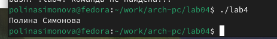

---
## Front matter
title: "Отчет по лабораторной работе 4"
subtitle: "Создание и процесс
обработки программ на языке ассемблера NASM"
author: "Симонова Полина Игоревна"

## Generic otions
lang: ru-RU
toc-title: "Содержание"

## Bibliography
bibliography: bib/cite.bib
csl: pandoc/csl/gost-r-7-0-5-2008-numeric.csl

## Pdf output format
toc: true # Table of contents
toc-depth: 2
lof: true # List of figures
fontsize: 12pt
linestretch: 1.5
papersize: a4
documentclass: scrreprt
## I18n polyglossia
polyglossia-lang:
  name: russian
  options:
	- spelling=modern
	- babelshorthands=true
polyglossia-otherlangs:
  name: english
## I18n babel
babel-lang: russian
babel-otherlangs: english
## Fonts
mainfont: IBM Plex Serif
romanfont: IBM Plex Serif
sansfont: IBM Plex Sans
monofont: IBM Plex Mono
mathfont: STIX Two Math
mainfontoptions: Ligatures=Common,Ligatures=TeX,Scale=0.94
romanfontoptions: Ligatures=Common,Ligatures=TeX,Scale=0.94
sansfontoptions: Ligatures=Common,Ligatures=TeX,Scale=MatchLowercase,Scale=0.94
monofontoptions: Scale=MatchLowercase,Scale=0.94,FakeStretch=0.9
mathfontoptions:
## Biblatex
biblatex: true
biblio-style: "gost-numeric"
biblatexoptions:
  - parentracker=true
  - backend=biber
  - hyperref=auto
  - language=auto
  - autolang=other*
  - citestyle=gost-numeric
## Pandoc-crossref LaTeX customization
figureTitle: "Рис."
tableTitle: "Таблица"
listingTitle: "Листинг"
lofTitle: "Список иллюстраций"
lolTitle: "Листинги"
## Misc options
indent: true
header-includes:
  - \usepackage{indentfirst}
  - \usepackage{float} # keep figures where there are in the text
  - \floatplacement{figure}{H} # keep figures where there are in the text
---

# Цель работы

Освоение процедуры компиляции и сборки программ, написанных на ассемблере NASM.

# Задание

1. Программа Hello world!

2. Транслятор NASM

3. Расширенный синтаксис командной строки NASM

4. Компоновщик LD

5. Запуск исполняемого файла

6. Задание для самостоятельной работы

# Теоретическое введение

Процесс создания ассемблерной программы можно изобразить в виде следующей схемы. 

{ #fig:000 width=70% }

В процессе создания ассемблерной программы можно выделить четыре шага:

1. Набор текста программы в текстовом редакторе и сохранение её в отдельном файле.
Каждый файл имеет свой тип (или расширение), который определяет назначение файла.
Файлы с исходным текстом программ на языке ассемблера имеют тип asm.

2. Трансляция — преобразование с помощью транслятора, например nasm, текста про-
граммы в машинный код, называемый объектным. На данном этапе также может быть
получен листинг программы, содержащий кроме текста программы различную допол-
нительную информацию, созданную транслятором. Тип объектного файла — o, файла
листинга — lst.

3. Компоновка или линковка — этап обработки объектного кода компоновщиком (ld),
который принимает на вход объектные файлы и собирает по ним исполняемый файл.
Исполняемый файл обычно не имеет расширения. Кроме того, можно получить файл
карты загрузки программы в ОЗУ, имеющий расширение map.

4. Запуск программы. Конечной целью является работоспособный исполняемый файл.
Ошибки на предыдущих этапах могут привести к некорректной работе программы,
поэтому может присутствовать этап отладки программы при помощи специальной
программы — отладчика. При нахождении ошибки необходимо провести коррекцию
программы, начиная с первого шага.

Из-за специфики программирования, а также по традиции для создания программ на язы-
ке ассемблера обычно пользуются утилитами командной строки (хотя поддержка ассемблера
есть в некоторых универсальных интегрированных средах).

# Выполнение лабораторной работы

## Программа Hello world!

Для начала, использую команды для установки nasm через терминал:(рис. [-@fig:001]).

sudo dnf install -y nasm

{ #fig:001 width=70% }

Рассмотрим пример простой программы на языке ассемблера NASM. Традиционно первая
программа выводит приветственное сообщение Hello world! на экран.

Создаю каталог для работы с программами на языке ассемблера NASM:(рис. [-@fig:002]).

mkdir -p ~/work/arch-pc/lab04

{ #fig:002 width=70% }

Перехожу в созданный каталог (рис. [-@fig:003]).

cd ~/work/arch-pc/lab04

{ #fig:003 width=70% }

Создаю текстовый файл с именем hello.asm (рис. [-@fig:004]).

touch hello.asm

и открываю этот файл с помощью текстового редактора gedit (рис. [-@fig:004]).

gedit hello.asm

{ #fig:004 width=70% }

и ввожу в него следующий текст:

; hello.asm

SECTION .data ; Начало секции данных

hello: DB 'Hello world!',10 ; 'Hello world!' плюс

; символ перевода строки

helloLen: EQU $-hello ; Длина строки hello

SECTION .text ; Начало секции кода

GLOBAL _start

_start: ; Точка входа в программу

mov eax,4 ; Системный вызов для записи (sys_write)

mov ebx,1 ; Описатель файла '1' - стандартный вывод

mov ecx,hello ; Адрес строки hello в ecx

mov edx,helloLen ; Размер строки hello

int 80h ; Вызов ядра

mov eax,1 ; Системный вызов для выхода (sys_exit)

mov ebx,0 ; Выход с кодом возврата '0' (без ошибок)

int 80h ; Вызов ядра

## Транслятор NASM

NASM превращает текст программы в объектный код. Например, для компиляции приведённого выше текста программы «Hello World» прописываю: (рис. [-@fig:005]).

nasm -f elf hello.asm

{ #fig:005 width=70% }

Транслятор преобразовывает текст программы из файла hello.asm в объектный код, который записывается в файл hello.o. С помощью команды ls проверяю, что объектный файл был создан. Созданный объектный файл имеет имя hello.o (рис. [-@fig:006]).

{ #fig:006 width=70% }

## Расширенный синтаксис командной строки NASM

Выполняю следующую команду: (рис. [-@fig:007]). 

nasm -o obj.o -f elf -g -l list.lst hello.asm

{ #fig:007 width=70% }

С помощью команды ls проверяю, что файлы были созданы.

{ #fig:008 width=70% }

## Компоновщик LD

Чтобы получить исполняемую программу, объектный файл передаю на обработку компоновщику:

ld -m elf_i386 hello.o -o hello

и с помощью команды ls проверяю, что исполняемый файл hello был создан.

{ #fig:009 width=70% }

Выполняю следующую команду:

ld -m elf_i386 obj.o -o main

{ #fig:010 width=70% }

Исполняемый файл имеет имя hello. Объектный файл из которого собран этот исполняемый файл имеет имя hello.o

## Запуск исполняемого файла

Запускаю созданный исполняемый файл, находящийся в текущем каталоге, набрав в командной строке:

./hello

{ #fig:011 width=70% }

## Задание для самостоятельной работы

В каталоге ~/work/arch-pc/lab04 с помощью команды cp создаю копию файла (рис. [-@fig:012]). 

hello.asm с именем lab4.asm

{ #fig:012 width=70% }

Открываю текстовый редактор gedit (рис. [-@fig:013]). 

{ #fig:013 width=70% }

Вношу изменения в текст программы в файле lab4.asm так, чтобы вместо Hello world! на экран выводилась строка с моим фамилией и именем. (рис. [-@fig:014]). 

{ #fig:014 width=70% }

Компилирую текст программы в объектный файл (рис. [-@fig:015]). 

{ #fig:015 width=70% }

Передаю объектный файл lab4.o на обработку компоновщику LD, чтобы получить исполняемый файл lab4 (рис. [-@fig:016]). 

{ #fig:016 width=70% }

Запускаю исполняемый файл, на экран действительно выводятся мои имя и фамилия (рис. [-@fig:017]). 

{ #fig:017 width=70% }

С помощью команд git add . и git commit добавляю файлы на гитхаб и отправляю файлы на сервер с помощью команды git push (рис. [-@fig:018]). 

{ #fig:018 width=70% }

# Выводы

При выполнении лабораторной работы я освоила процедуры компиляции и сборки программ, написанных на ассемблере NASM.

# Список литературы
 [Архитектура 4](https://esystem.rudn.ru/pluginfile.php/2089084/mod_resource/content/0/%D0%9B%D0%B0%D0%B1%D0%BE%D1%80%D0%B0%D1%82%D0%BE%D1%80%D0%BD%D0%B0%D1%8F%20%D1%80%D0%B0%D0%B1%D0%BE%D1%82%D0%B0%20%E2%84%964.%20%D0%A1%D0%BE%D0%B7%D0%B4%D0%B0%D0%BD%D0%B8%D0%B5%20%D0%B8%20%D0%BF%D1%80%D0%BE%D1%86%D0%B5%D1%81%D1%81%20%D0%BE%D0%B1%D1%80%D0%B0%D0%B1%D0%BE%D1%82%D0%BA%D0%B8%20%D0%BF%D1%80%D0%BE%D0%B3%D1%80%D0%B0%D0%BC%D0%BC%20%D0%BD%D0%B0%20%D1%8F%D0%B7%D1%8B%D0%BA%D0%B5%20%D0%B0%D1%81%D1%81%D0%B5%D0%BC%D0%B1%D0%BB%D0%B5%D1%80%D0%B0%20NASM.pdf)
