---
## Front matter
title: "Отчет по лабораторной работе №7"
subtitle: "Команды безуловного и условного переходов в Nasm. Программирвоание втевлений"
author: "Симонова Полина Игоревна"

## Generic otions
lang: ru-RU
toc-title: "Содержание"

## Bibliography
bibliography: bib/cite.bib
csl: pandoc/csl/gost-r-7-0-5-2008-numeric.csl

## Pdf output format
toc: true # Table of contents
toc-depth: 2
lof: true # List of figures
fontsize: 12pt
linestretch: 1.5
papersize: a4
documentclass: scrreprt
## I18n polyglossia
polyglossia-lang:
  name: russian
  options:
	- spelling=modern
	- babelshorthands=true
polyglossia-otherlangs:
  name: english
## I18n babel
babel-lang: russian
babel-otherlangs: english
## Fonts
mainfont: IBM Plex Serif
romanfont: IBM Plex Serif
sansfont: IBM Plex Sans
monofont: IBM Plex Mono
mathfont: STIX Two Math
mainfontoptions: Ligatures=Common,Ligatures=TeX,Scale=0.94
romanfontoptions: Ligatures=Common,Ligatures=TeX,Scale=0.94
sansfontoptions: Ligatures=Common,Ligatures=TeX,Scale=MatchLowercase,Scale=0.94
monofontoptions: Scale=MatchLowercase,Scale=0.94,FakeStretch=0.9
mathfontoptions:
## Biblatex
biblatex: true
biblio-style: "gost-numeric"
biblatexoptions:
  - parentracker=true
  - backend=biber
  - hyperref=auto
  - language=auto
  - autolang=other*
  - citestyle=gost-numeric
## Pandoc-crossref LaTeX customization
figureTitle: "Рис."
tableTitle: "Таблица"
listingTitle: "Листинг"
lofTitle: "Список иллюстраций"
lolTitle: "Листинги"
## Misc options
indent: true
header-includes:
  - \usepackage{indentfirst}
  - \usepackage{float} # keep figures where there are in the text
  - \floatplacement{figure}{H} # keep figures where there are in the text
---

# Цель работы

Изучение команд условного и безусловного переходов. Приобретение навыков написания
программ с использованием переходов. Знакомство с назначением и структурой файла
листинга.

# Задание

1. Реализация переходов в NASM
2. Изучение структуры файлов листинга
3. Задание для самостоятельной работы


# Теоретическое введение

Для реализации ветвлений в ассемблере используются так называемые команды передачи
управления или команды перехода. Можно выделить 2 типа переходов:

• условный переход – выполнение или не выполнение перехода в определенную точку
программы в зависимости от проверки условия.

• безусловный переход – выполнение передачи управления в определенную точку про-
граммы без каких-либо условий.

# Выполнение лабораторной работы

## Реализация переходов в NASM

Создаю каталог для программ лабораторной работы №7 (рис. -@fig:001).

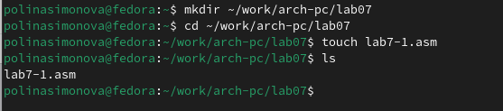{#fig:001 width=70%}

Копирую файл in_out.asm в каталог для выполнения лабораторной работы (рис. -@fig:002).

{#fig:002 width=70%}

Копирую код из листинга в файл будущей программы (рис. -@fig:003).

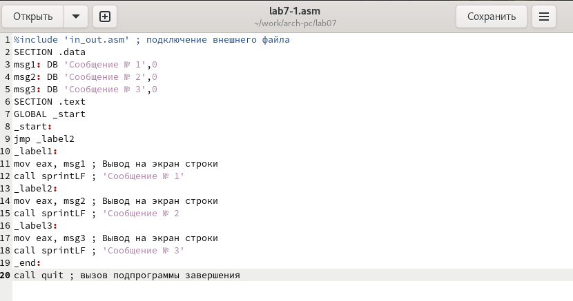{#fig:003 width=70%}

Создаю исполняемый файл и запускаю его. (рис. -@fig:004).

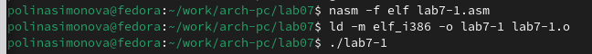{#fig:004 width=70%}

Вывод программы - вывелось все, кроме Сообщения №1 (рис. -@fig:005).

{#fig:005 width=70%}

Теперь изменяю текст программы в соответствии с листингом 7.2 (рис. -@fig:006).

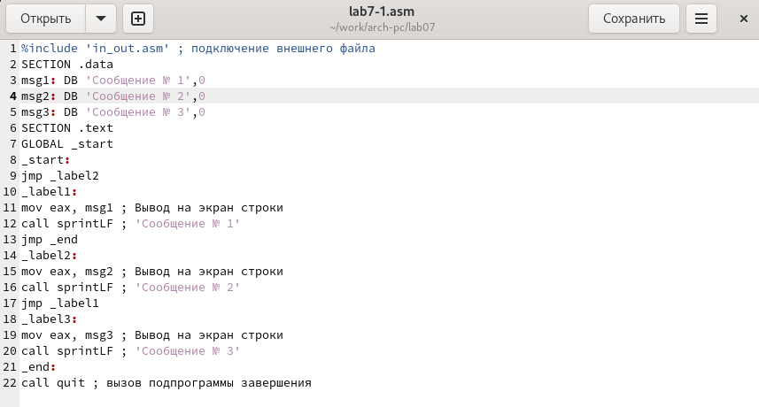{#fig:006 width=70%}

Создаю исполняемый файл. (рис. -@fig:007).

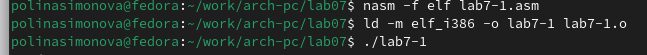{#fig:007 width=70%}

В этот раз вывод начался с Сообщения №2, затем вывелось Сообщение №1. (рис. -@fig:008).

{#fig:008 width=70%}

Теперь изменяю текст программы так, чтобы все три сообщения вывелись в обратном порядке  (рис. -@fig:009).

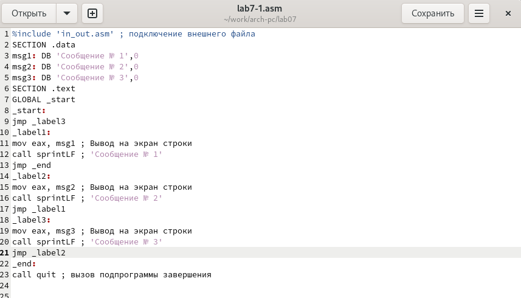{#fig:009 width=70%}

Работа выполнена корректно, программа в нужном мне порядке выводит сообщения(рис. -@fig:010).

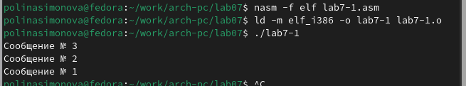{#fig:010 width=70%}

Создаю новый рабочий файл, проверяю с помощью ls что файл был создан.(рис. -@fig:011).

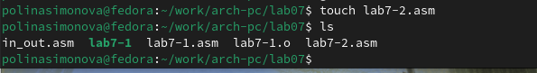{#fig:011 width=70%}

Программа выводит значение переменной с максимальным значением, проверяю работу программы с разными входными данными (рис. -@fig:012).

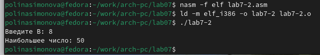{#fig:012 width=70%}

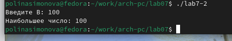{#fig:013 width=70%}

## Изучение структуры файла листинга

Создаю файл листинга с помощью флага -l команды nasm и открываю его с помощью текстового редактора gedit (рис. -@fig:010).

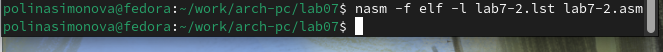{#fig:014 width=70%}

{#fig:015 width=70%}

Первое значение в файле листинга - номер строки, и он может вовсе не совпадать с номером строки изначального файла. Второе вхождение - адрес, смещение машинного кода относительно начала текущего сегмента, затем непосредственно идет сам машинный код, а заключает строку исходный текст прогарммы с комментариями.

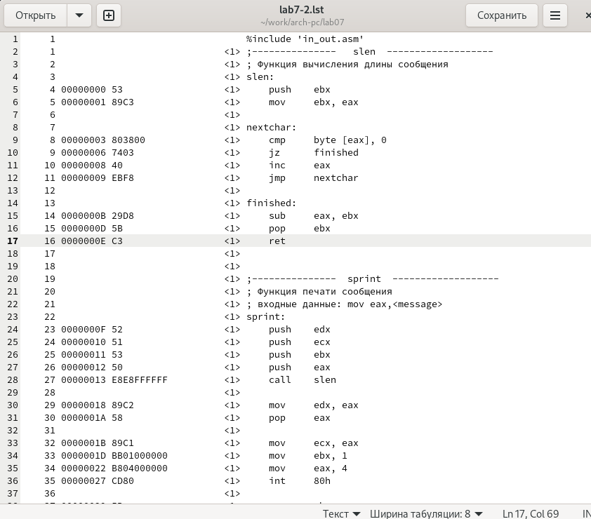{#fig:016 width=70%}

Удаляю один операнд из случайной инструкции, чтобы проверить поведение файла листинга в дальнейшем (рис. -@fig:011).

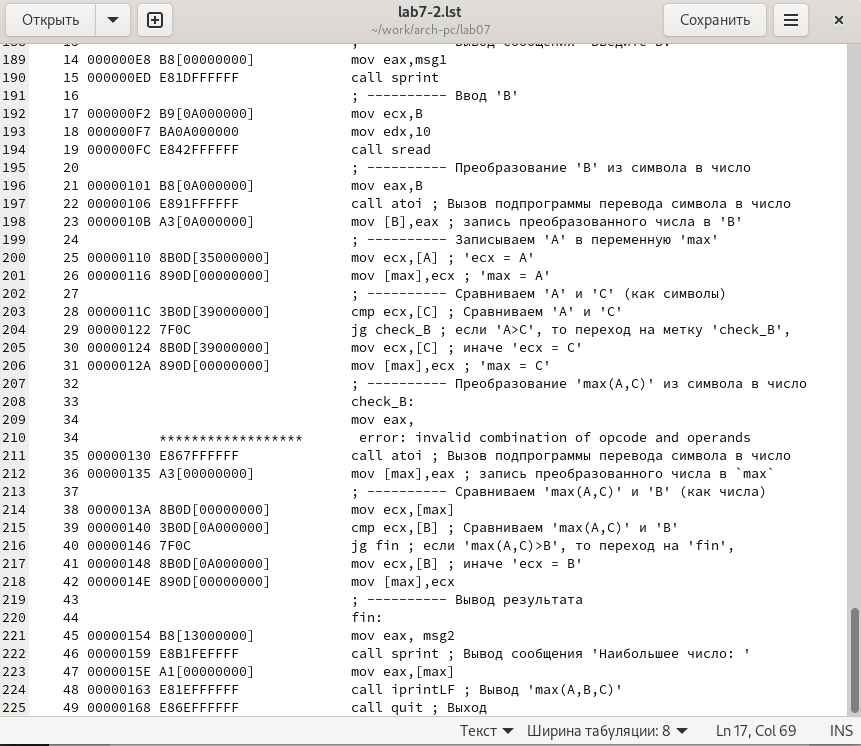{#fig:018 width=70%}

В новом файле листинга показывает ошибку, которая возникла при попытке трансляции файла. Никакие выходные файлы при этом помимо файла листинга не создаются. (рис. -@fig:012).

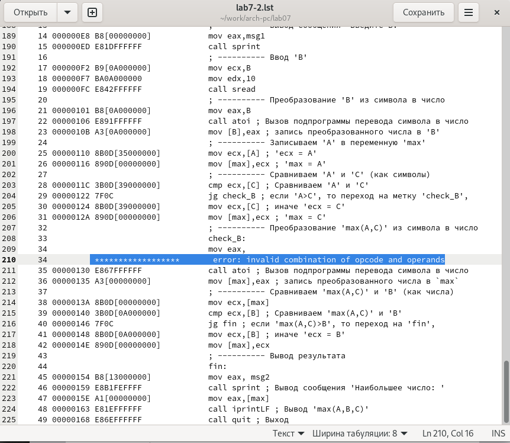{#fig:019 width=70%}

## Задания для самостоятельной работы

Буду использовать свой вариант - седьмой - из предыдущей лабораторной работы. Возвращаю операнд к функции в программе и изменяю ее так, чтобы она выводила переменную с наименьшим значением 


Код первой программы: 

```NASM
%include 'in_out.asm'

SECTION .data
msg1 db 'Введите В: ', 0h
msg2 db 'Наименьшее число: ', 0h
A dd '45'
C dd '15'

SECTION .bss
min resb 10
B resb 10

SECTION .text
GLOBAL _start
_start:

mov eax, msg1
call sprint

mov ecx, B
mov edx, 10
call sread

mov eax, B
call atoi
mov [B], eax

mov ecx, [A]
mov [min], ecx

cmp ecx, [C]
jg check_B
mov ecx, [C]
mov [min], ecx

check_B:
mov eax, min
call atoi
mov [min], eax

mov ecx, [min]
cmp ecx, [B]
jb fin
mov ecx, [B]
mov [min], ecx

fin:
mov eax, msg2
call sprint
mov eax, [min]
call iprintLF
call quit
```

Проверяю корректность написания первой программы (рис. -@fig:014).

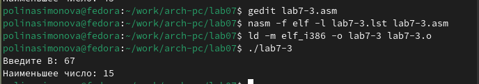{#fig:023 width=70%}

Пишу программу, которая будет вычислять значение заданной функции согласно моему варианту для введенных с клавиатурых переменных a и x (рис. -@fig:015).

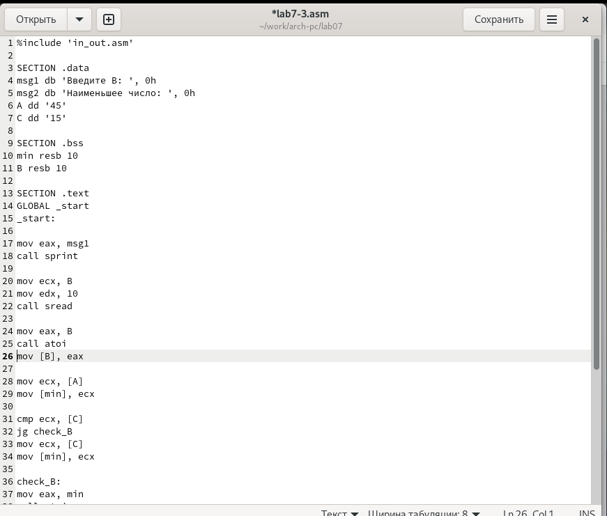{#fig:021 width=70%}

Код второй программы: 

```NASM
%include 'in_out.asm'
SECTION .data
msg_x: DB 'Введите значение переменной x: ', 0
msg_a: DB 'Введите значение переменной a: ', 0
res: DB 'Результат: ', 0
SECTION .bss
x: RESB 80
a: RESB 80
SECTION .text
GLOBAL _start
_start:
mov eax, msg_x
call sprint
mov ecx, x
mov edx, 80
call sread
mov eax, x
call atoi
mov edi, eax

mov eax, msg_a
call sprint
mov ecx, a
mov edx, 80
call sread
mov eax, a
call atoi
mov esi, eax

cmp edi, esi
jle add_values
mov eax, esi
jmp print_result

add_values:
mov eax, edi
add eax, esi

print_result:
mov edi, eax
mov eax, res
call sprint
mov eax, edi
call iprintLF
call quit
```

Транслирую и компоную файл, запускаю и проверяю работу программмы для различных значений a и x (рис. -@fig:016).

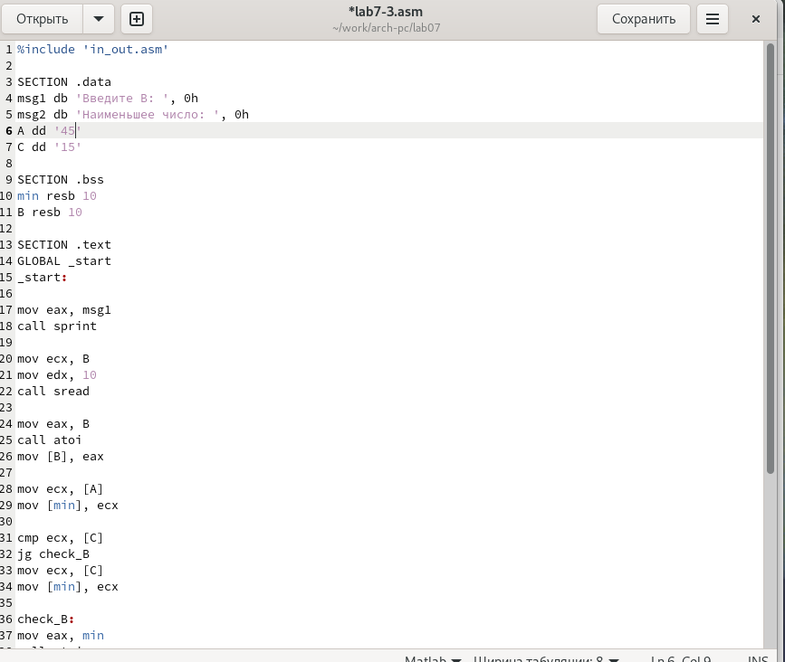{#fig:022 width=70%}


# Выводы

При выполнении лабораторной работы я изучила команды условных и безусловных переходво, а также приобрела навыки написания программ с использованием перходов, познакомилась
с назначением и структурой файлов листинга.

# Список литературы

1. [Лабораторная работа №7](https://esystem.rudn.ru/pluginfile.php/2089087/mod_resource/content/0/%D0%9B%D0%B0%D0%B1%D0%BE%D1%80%D0%B0%D1%82%D0%BE%D1%80%D0%BD%D0%B0%D1%8F%20%D1%80%D0%B0%D0%B1%D0%BE%D1%82%D0%B0%20%E2%84%967.%20%D0%9A%D0%BE%D0%BC%D0%B0%D0%BD%D0%B4%D1%8B%20%D0%B1%D0%B5%D0%B7%D1%83%D1%81%D0%BB%D0%BE%D0%B2%D0%BD%D0%BE%D0%B3%D0%BE%20%D0%B8%20%D1%83%D1%81%D0%BB%D0%BE%D0%B2%D0%BD%D0%BE%D0%B3%D0%BE%20%D0%BF%D0%B5%D1%80%D0%B5%D1%85%D0%BE%D0%B4%D0%BE%D0%B2%20%D0%B2%20Nasm.%20%D0%9F%D1%80%D0%BE%D0%B3%D1%80%D0%B0%D0%BC%D0%BC%D0%B8%D1%80%D0%BE%D0%B2%D0%B0%D0%BD%D0%B8%D0%B5%20%D0%B2%D0%B5%D1%82%D0%B2%D0%BB%D0%B5%D0%BD%D0%B8%D0%B9.pdf)
